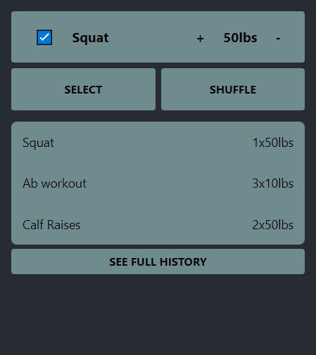
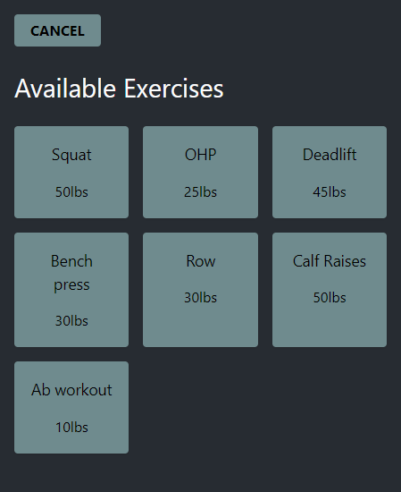
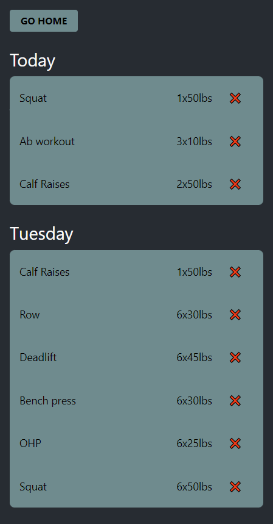

# Description

Exercise tracker that make it easier to get your workout started by focusing on completing One Set at a time.

Features

-   Recommends an Exercise base on your exercise history
-   Manages your workout routine and increases the weights as needed
-   Encouranges you to be more consistent in your workouts instead of perfect

# Screenshots

<div>
    
    
    
</div>

# Development

[](https://github.com/davidc4747/one-set) [](https://github.com/davidc4747/one-set/pulls)

**Tools**: React, idb, indexedDB, Cypress, vite

Setup:

```shell
git clone https://github.com/davidc4747/one-set
cd one-set/
npm install
npm run start
```
